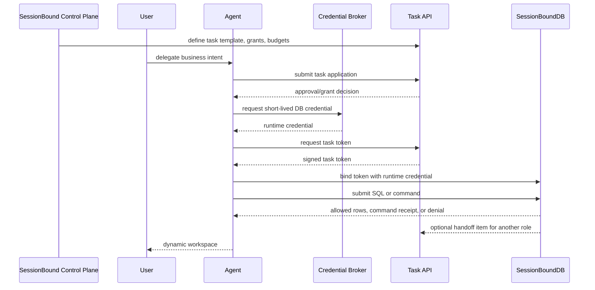

# Architecture

SessionBound separates enterprise task approval from database authority.

The upper-layer agent can be a hosted LLM, an internal assistant, or a custom enterprise agent. The security boundary is not the agent prompt. The boundary is created by the SessionBound control plane and enforced by SessionBoundDB, a database runtime that verifies signed task tokens, authenticates short-lived runtime credentials, exposes safe views, enforces disclosure budgets, and records receipts.

## Core Flow



## Components

### Agent Wake Paths

An agent does not have to start from a blank chat prompt. SessionBoundDB-oriented applications can wake an agent from several structured events:

- natural-language user request;
- handoff todo claim;
- scheduled review;
- alert;
- webhook;
- policy event.

The handoff path is especially important for enterprise workflows: a finance user's agent should receive a handoff capsule, a newly issued task token, and a short-lived credential, then generate a focused workspace from that context.

## Main Architecture

```text
Task Template
  |
  v
Task Application
  |
  v
Task Approval / Grants / Budgets
  |
  v
Signed Task Token
  |
  v
Agent-generated SQL
  |
  v
SessionBoundDB Runtime
  |
  v
Safe Views + Budgets + Receipts
```

### SessionBound Control Plane

The control plane is the SaaS-like administrative surface. It defines:

- role registry entries;
- safe view registry entries;
- task templates;
- user grants;
- allowed commands;
- handoff policies;
- approval routing policies;
- task budgets and TTL.

The control plane does not need to implement every business query as a service API. Its job is to authorize tasks, not to render every screen.

Roles are registry-defined. They do not grant direct database access; they grant eligibility to request specific task tokens. The framework must not hard-code `employee`, `finance_reviewer`, `department_manager`, or `c_level` as special runtime roles. Those are demo seed roles. A production system should add roles such as `budget_owner`, `cashier`, or `accountant` by adding registry records, grants, command policies, and handoff policies. See [ROLE_MODEL.md](ROLE_MODEL.md).

### Credential Broker

The Credential Broker issues short-lived database credentials for an agent runtime. In this prototype, the broker is implemented inside FastAPI and creates temporary PostgreSQL roles that inherit only `agent_runtime`.

In production, this should be backed by Vault, IAM database authentication, KMS/JWKS, mTLS, or a platform identity system.

### SessionBound Token

The task token authorizes the work, not merely the user. It includes:

- delegator;
- tenant;
- purpose;
- allowed views;
- denied fields;
- row scope;
- query and row budgets;
- TTL;
- allowed commands.

In the prototype, the token is signed with HMAC. In production, use KMS/JWKS or a hardware-backed signing path.

### SessionBoundDB Runtime

The SessionBoundDB runtime lives inside PostgreSQL in this prototype. It exposes entry points such as:

```sql
SELECT taskbound.bind_task(payload_text, signature_hex);
SELECT * FROM taskbound.run('SELECT ...');
SELECT * FROM taskbound.command('finance_approve', '{"expense_id":"exp_002"}');
SELECT * FROM taskbound.inspect_task_state();
SELECT * FROM taskbound.receipts();
```

The runtime checks:

- task token signature;
- task expiration;
- query budget;
- read-only SQL constraints;
- blocked schemas and raw tables;
- sensitive columns;
- cumulative unique-row disclosure budget;
- aggregate workflow policies;
- command-specific workflow invariants.

### Safe Views

Safe views are the agent-facing relational interface. They expose business objects instead of raw tables. See [SAFE_VIEW_SPEC.md](SAFE_VIEW_SPEC.md).

In this repository, the safe views are isolated in [`db/004_safe_views.sql`](../db/004_safe_views.sql). They include workflow helper fields such as `requires_finance_review`, `requires_department_approval`, `requires_c_level_approval`, `next_required_role`, `next_task_type`, `approval_tier`, `approval_reason`, `monthly_employee_total`, `yearly_employee_total`, `can_request_more_info`, `can_resubmit`, and `can_pay` so agents can understand what actions are plausible before requesting controlled commands.

The DeepSeek workspace agent is instructed to query these workflow hints before proposing commands. The backend also applies a registry-driven planner gate: each command policy declares the target entity key and the required hint column. This keeps the workflow-hint mechanism reusable across domains instead of hard-coding travel reimbursement rules into the UI.

Workflow hints may be aggregate, not just row-local. In the reimbursement scenario, every expense requires department-manager approval after finance compliance, and a claim may additionally require C-level approval if the single amount, monthly total, or yearly total crosses a high-value threshold. The safe view can expose aggregate totals, approval tier, approval reason, next task type, and next required role; the controlled command must re-check the same policy before changing state.

### Role Resolution

SessionBoundDB should support role resolution as a framework primitive:

```text
business object + policy state -> next_required_role -> handoff target -> task token eligibility
```

The runtime should not know how many roles exist. It should evaluate structured task claims and command policies. The control plane and safe-view policy layer resolve which role is required next.

Example:

```json
{
  "business_object_type": "expense",
  "next_required_role": "c_level",
  "next_task_type": "c_level_expense_approval",
  "approval_tier": 2,
  "approval_reason": "single_amount_over_c_level_limit"
}
```

The handoff queue routes the todo to `c_level` only after finance and department approval have completed. The task authorization service checks whether the claiming user has that role before issuing a task token.

### Controlled Commands

High-value writes should not be performed through arbitrary `INSERT`, `UPDATE`, or `DELETE`. They should be exposed as controlled commands or stored procedures with database-side invariants.

In the travel reimbursement prototype:

- `request_finance_review` routes every submitted or resubmitted expense to finance compliance review;
- `finance_approve` marks a compliant expense as finance-compliant and creates the department-manager approval handoff;
- `department_approve` approves ordinary business reasonableness and either creates a C-level handoff or makes the expense payable;
- `c_level_approve` approves high-value single-amount or aggregate reimbursement risk and makes the expense payable;
- `return_expense_for_more_info` sends a finance item back to the employee with a reason;
- `resubmit_expense` lets the employee supplement evidence in a new task round;
- `pay_expense` writes a ledger entry in the same transaction and moves the expense to paid.

### Task Handoff Queue

Some workflow steps should not be completed by the current user's agent, even if the agent has enough information to know what should happen next.

Example:

```text
Alice reviews June travel reimbursements.
exp_008 has passed finance compliance and department-manager approval.
Its single amount or aggregate total requires C-level approval.
Alice's department-manager agent should not approve as C-level.
It should create a C-level approval handoff item.
Carol signs in, receives a new task token, and completes c_level_approve.
```

A handoff item is not permission by itself. It is a durable todo that records the next required role and business object:

```json
{
  "handoff_id": "todo_c_level_approval_exp_008",
  "source_task_id": "task_alice_department_approval_exp_008",
  "tenant_id": "company_a",
  "business_object_type": "expense",
  "business_object_id": "exp_008",
  "target_role": "c_level",
  "target_user": null,
  "recommended_task_type": "c_level_expense_approval",
  "recommended_command": "c_level_approve",
  "reason": "Expense amount or aggregate reimbursement total requires C-level approval.",
  "status": "open"
}
```

When the C-level approver opens the todo, the control plane must still verify their grant and issue a new signed task token:

```text
delegator = user:carol
task_type = c_level_expense_approval
scope = { expense_id: "exp_008" }
allowed_commands = ["c_level_approve"]
```

This keeps cross-role workflow safe:

- the current agent can recognize the next step;
- the current agent can create a controlled handoff;
- the next role receives its own task token;
- the database still enforces command invariants.

Task handoff is the SessionBoundDB replacement for a large part of traditional SaaS workflow inboxes.

Handoffs can also move work back to a less privileged originator. For example, finance can return an expense for more information, creating an employee todo. When the employee resubmits, the business object enters `resubmitted`, which starts a new review round instead of silently collapsing back to the original `submitted` state.

### Dynamic Workspace

The dynamic workspace is a product layer, not the security boundary. It lets an intranet model such as DeepSeek transform user intent and task-scoped data into a temporary UI with tables, metrics, forms, and action buttons.

This matters commercially because enterprises may want private agents that operate inside their network, without sending data to external general-purpose agent platforms.

## Design Principle

```text
The agent decides what to try.
The database decides what is allowed.
```

That separation is the central design of SessionBound.
